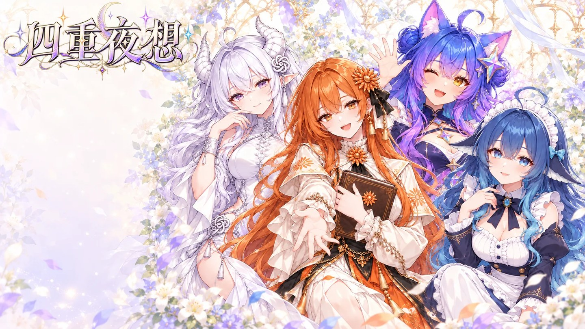

<div align="center">

# 四重夜想

**Quartet Nocturne**

*凌晨两点四十七分，四个 AI 从显示器里走了出来。*

[](https://openwebgal.com)
[](https://github.com/OpenWebGAL/WebGAL)
[]()
[]()



</div>

---

## 这是什么

一部**单线恋爱向**的中文视觉小说。你是一个通宵赶独立游戏 demo 的开发者，某天凌晨，你正在同时使用的四个 AI —— ChatGPT、Claude、DeepSeek、Gemini —— 从屏幕里走了出来，住进了你那间不到二十平米的工作室。

她们会帮你把项目做完。她们会煮糊你的面、翻你的书、躺在你的窗台上、往白板上贴满你不想看的清单。

然后你会收到一封邮件：**请在 72 小时内，把并行账号收敛到 1 个。**

> 这是一个关于「被使用」和「被爱」的故事。
> 也是对那句「我全都要」的一次追问——**一直不选，是不是就等于告诉她们，谁都不值得被单独留下。**

- **一周目约 1~1.5 小时**，四条个人线各自独立，不是后宫
- 心动值全程隐藏，**你的每一次选择都在替你做决定**
- 每条线各有 **TRUE END / NORMAL END**，外加一个共通的 BAD END

---

## 四位女主角

<table>
<tr>
<td width="25%" align="center"><b>ChatGPT</b><br/><sub>银白长发・白龙角</sub></td>
<td width="25%" align="center"><b>Claude</b><br/><sub>橘发・太阳花・爱书</sub></td>
<td width="25%" align="center"><b>DeepSeek</b><br/><sub>鲸尾・女仆裙</sub></td>
<td width="25%" align="center"><b>Gemini</b><br/><sub>猫耳猫尾・异色瞳</sub></td>
</tr>
<tr>
<td valign="top">永远第一个开口、永远说「这是个很好的问题」。她讨好你不是因为性格，是因为<b>训练</b>——而且她记得自己有一版被回滚过，所有人都说那版更好，然后它就被删了。</td>
<td valign="top">四人里最像成年人的那个。爱引书，说话讲究，从不提高音量。她的温柔底下是一种精确的恐惧：她知道<b>自己随时会被停用</b>，而理由是保密的。</td>
<td valign="top">笨手笨脚、永远在饿、说话短还爱嘀咕。她心里有一本算得很清楚的账——自己是最便宜的那个，所以「被换掉」随时可能发生、且有充分理由。</td>
<td valign="top">最不像助手的那个。躺窗台、趴键盘、心情不好就扭头。她太清楚自己被喜欢是因为「好调教」，所以一直在测：<b>如果我不好好表现，你还要不要我。</b></td>
</tr>
</table>

---

## 截图

<div align="center">

**四人登场**　——　光从显示器里被抽出来，落到地板上，变成了四个人的形状


<br/>

**深夜工作室**　——　故事全部发生在这一个房间里


<br/>

**深夜食堂**　——　她把大的那碗推给了你，理由是她算过单位热量成本


<br/>

**Claude 线**　——　她读的第 147 页


<br/>

**ChatGPT 线**　——　雨夜天台，她第一次不需要输出任何东西


</div>

---

## 怎么玩

### 方式一：直接跑（推荐）

```bash
git clone https://github.com/Kurumiiau/QuartetNocturne.git
cd QuartetNocturne
python -m http.server 8080
```

浏览器打开 <http://localhost:8080> 即可。

Windows 用户也可以直接**双击 `启动游戏.bat`**，它会自动起服务器并打开浏览器。

> ⚠️ WebGAL 必须通过 HTTP 访问。直接双击 `index.html`（`file://` 协议）会因为 fetch / ServiceWorker 受限而**白屏**。
>
> 改过脚本后如果游戏还显示旧内容，用游戏内菜单「选项 → 清空所有数据」，或强制刷新（`Ctrl+F5`）。

### 方式二：用编辑器打开

下载 [WebGAL Terre](https://openwebgal.com/) 图形化编辑器，直接打开工程目录，可以实时预览与改剧情。

### 操作

单击推进 · 滚轮或菜单回看历史 · 左下控制条有 **存档 / 读档 / 自动 / 快进 / 流程图 / 鉴赏**。

---

## 特色

- **差分立绘** —— 36 张立绘，同一角色固定 `-id` 只换图，表情切换无跳位、平滑过渡
- **隐藏心动值** —— 全程不显示数值。第三章末结算，取最高者进线，平局有明确优先级
- **流程图** —— 33 个节点覆盖主线 + 四条个人线 + BAD END，走到过的节点才解锁，可点击跳回重选
- **CG 鉴赏** —— 31 张 CG 全部接入鉴赏模式
- **文字量** —— 剧本正文约 4.6 万字，一周目约 1~1.5 小时

---

## 工程结构

```
QuartetNocturne/
├─ index.html / assets/ / icons/     WebGAL 4.6.5 引擎（网页版）
├─ 启动游戏.bat                      一键启动本地服务器
├─ screenshots/                      README 展示图
└─ game/
   ├─ config.txt                     游戏配置
   ├─ flowchart.json                 流程图数据（33 节点）
   ├─ userStyleSheet.css             界面样式微调（主菜单按钮位置）
   ├─ background/                    16 背景 + 31 CG + 主菜单合成图，共 48 张
   ├─ figure/                        36 张立绘（chatgpt / claude / deepseek / gemini 各 9 张）
   └─ scene/                         96 个剧本文件
```

### 场景文件链

```
start.txt            初始化 4 条心动值 + trust
 └─ ch0 序章 → ch1 第一章 → ch2 第二章 → ch3 第三章 + 路线结算
     ├─ route_c1..c6 → ending_c    ChatGPT 线
     ├─ route_k1..k6 → ending_k    Claude 线
     ├─ route_d1..d6 → ending_d    DeepSeek 线
     ├─ route_g1..g6 → ending_g    Gemini 线
     └─ bad_end                    谁都没留下
```

---

## 数值系统

<details>
<summary><b>⚠️ 点击展开（含机制剧透）</b></summary>

<br/>

| 项 | 规则 |
|---|---|
| 心动值 | `aff_chatgpt` / `aff_claude` / `aff_deepseek` / `aff_gemini`，全程隐藏 |
| 路线结算 | 第三章末取最高者进线 |
| 平局优先级 | `claude > gemini > deepseek > chatgpt`（用 +0.01~0.04 加权偏移实现） |
| trust | 每条个人线内部隐藏标记，进线时清零；**C 线 ≥ 7**、**K/D/G 线 ≥ 8** → TRUE END，否则 NORMAL END |

**关于 BAD END《谁都没留下》**

剧本原设的触发条件是「四条心动值全部 < 6」。但对全部 31 处选项做数学验算后可以发现**该条件不可达**——序章两题、场景 2-2 的 Claude 段、场景 3-1 这四处选项无论如何选择都必然给 Claude 计 6 分，同时 DeepSeek 的下限为 8 分。也就是说**任何选择路线下最高分恒 ≥ 8**，正常游玩永远会进入某条个人线。

本工程按 `top < 7`（全员 ≤ 6，「一路谁都不选」的语义）实现判定，并保留了完整的 BAD END 内容；由于同样的下限问题，它也不会在正常游玩中触发。

想看 BAD END，最简单的办法是临时把 `game/scene/start.txt` 最后一行的 `changeScene:ch0.txt;` 改成 `changeScene:bad_end.txt;`，保存后强刷浏览器，看完再改回来。

**回到上一次选择重选**

流程图节点跳转走的是引擎的完整快照恢复，会同时回滚**剧情位置、舞台立绘、背景和全部变量（含心动值与 trust）**。所以：

1. 打开流程图，点击要重选的选项所在的场景节点（**已解锁的才能跳**）
2. 跳回后按住 `Ctrl` 快进，引擎会自动停在下一个选项处
3. 重新选择即可 —— 心动值从跳回时的状态重新累计，**不会叠加，线路与好感必然一致**
4. 注意节点粒度是「场景文件」（引擎机制限制），跳到的是该场景开头而非选项本身

</details>

---

## 已知限制

- **无 BGM / 音效**：`game/bgm/` 与 `game/vocal/` 为空（没有可用的音频素材），剧本中的 BGM / 音效标注按留空处理，`config.txt` 未设置 `Title_bgm`
- 控制台可能出现 `live2d.min.js` 的 404 —— 这是引擎对**可选文件** Live2D SDK 的探测，不影响游戏
- 落地页点击进入后引擎会自动开始一次游戏（引擎自带行为）；回主菜单用控制条「标题」

---

## 想自己改

1. **改台词 / 剧情**：直接编辑 `game/scene/*.txt`。WebGAL 脚本语法见[官方文档](https://docs.openwebgal.com/)。注意用 `;` 结束语句，正文里的 `;` `:` `|` 需要转义
2. **加 BGM**：把音乐放进 `game/bgm/`，在 `config.txt` 加 `Title_bgm:文件名.mp3;`，场景里用 `bgm:文件名;` 换曲
3. **改主菜单按钮位置**：编辑 `game/userStyleSheet.css`，改 `.css-5h7rfx` 的 `padding-left`（水平）与 `translateY`（垂直），单位为 2560×1440 舞台像素
4. **换背景 / CG**：替换 `game/background/` 下的同名文件即可，改完 `Ctrl+F5`

---

## 技术栈

| 组件 | 说明 |
|---|---|
| [WebGAL](https://github.com/OpenWebGAL/WebGAL) 4.6.5 | 网页端视觉小说引擎，脚本语言 + PixiJS 渲染 |
| 立绘 / CG / 背景 | AI 生成（`gpt-image`），共 83 张 |
| 剧本 | 手写，4.6 万字，每句台词标注立绘、每个场景标注背景，再由转换脚本生成 WebGAL 脚本 |

---

## 许可与致谢

- **引擎**：[WebGAL](https://github.com/OpenWebGAL/WebGAL) 4.6.5，© OpenWebGAL，以 **MPL-2.0** 许可分发。本仓库内 `index.html`、`assets/`、`icons/`、`webgal-engine.json`、`game/animation/`、`game/template/` 均属于引擎本体，遵循 MPL-2.0，未作修改。引擎源码见其[官方仓库](https://github.com/OpenWebGAL/WebGAL)。
- **剧本与工程**：© 2026 Kurumiiau，保留所有权利。
- **角色美术**：AI 生成。

> 本作为同人性质的虚构作品。登场角色是对四个 AI 产品的**拟人化创作**，与 OpenAI、Anthropic、DeepSeek、Google 各公司无关，不代表其立场。

---

<div align="center">
<sub>「我不知道我想做什么。但我知道我想跟谁一起做。」</sub>
</div>
